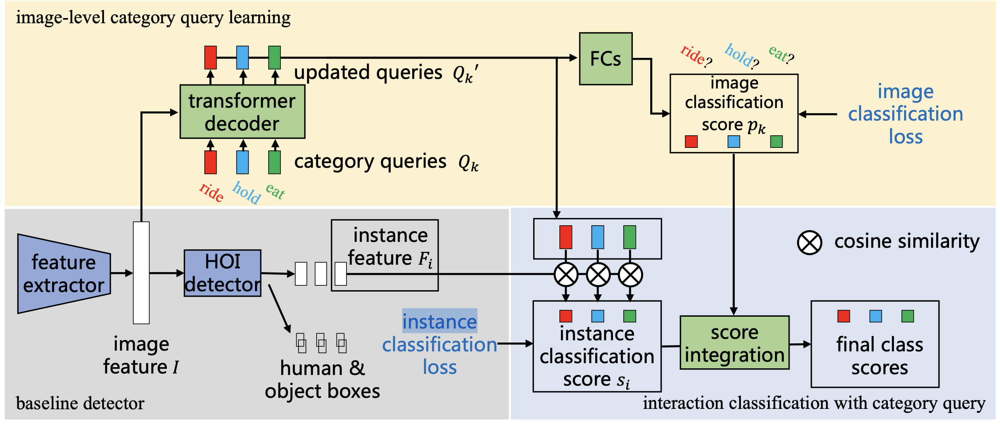

# Category Query Learning for Human-Object Interaction Classification

This repository contains the official implementation of the paper "[Category Query Learning for Human-Object Interaction Classification](https://arxiv.org/abs/2303.14005)" (CVPR 2023).

<div align="center">
  
  <p>Overview of our method</p>
</div>

Unlike most previous HOI methods that focus on learning better human-object features, we propose a novel and complementary approach called category query learning. Such queries are explicitly associated to interaction categories, converted to image specific category representation via a transformer decoder, and learnt via an auxiliary image-level classification task.

## Preparation

### Dependencies

You can install the python libraries with this command:
```shell
pip install -r requirements.txt
```
Actually `torch>=1.5.1` is probably fine, but we have not tested all versions.

### Dataset

#### HICO-DET

The images in HICO-DET dataset can be downloaded [here](https://drive.google.com/open?id=1QZcJmGVlF9f4h-XLWe9Gkmnmj2z1gSnk). After finishing downloading, unpack the tarball (`hico_20160224_det.tar.gz`) to the `data` directory.

The annotation files can be downloaded from [here](https://drive.google.com/drive/folders/1XEatvedVHm_VAwyZwcZ7eduNCl7QwD1b?usp=sharing). Note the training annotation is slightly different than previous versions as some HOI instances with the same human and object are merged as one, and this may affect the performance by about 0.1 mAP.
The downloaded annotation files should be placed as follows.
```
qpic
 |─ data
 │   └─ hico_20160224_det
 |       |─ annotations
 |       |   |─ trainval_hico.json
 |       |   |─ test_hico.json
 |       |   └─ corre_hico.npy
 :       :
```

#### V-COCO

First clone the repository of V-COCO from [here](https://github.com/s-gupta/v-coco), and then follow the instruction to generate the file `instances_vcoco_all_2014.json`. Next, download the prior file `prior.pickle` from [here](https://drive.google.com/drive/folders/10uuzvMUCVVv95-xAZg5KS94QXm7QXZW4). Place the files and make directories as follows.
```
qpic
 |─ data
 │   └─ v-coco
 |       |─ data
 |       |   |─ instances_vcoco_all_2014.json
 |       |   :
 |       |─ prior.pickle
 |       |─ images
 |       |   |─ train2014
 |       |   |   |─ COCO_train2014_000000000009.jpg
 |       |   |   :
 |       |   └─ val2014
 |       |       |─ COCO_val2014_000000000042.jpg
 |       |       :
 |       |─ annotations
 :       :
```

Following most previous methods, the annotation file have to be converted to the HOIA format. The conversion can be conducted as follows.
```shell
PYTHONPATH=data/v-coco \
        python convert_vcoco_annotations.py \
        --load_path data/v-coco/data \
        --prior_path data/v-coco/prior.pickle \
        --save_path data/v-coco/annotations
```
Note that only Python2 can be used for this conversion because `vsrl_utils.py` in the v-coco repository shows a error with Python3.

V-COCO annotations with the HOIA format, `corre_vcoco.npy`, `test_vcoco.json`, and `trainval_vcoco.json` will be generated to `annotations` directory.

### Pre-trained parameters for initialization

We also use the COCO-pretrained parameters of DETR, same as previous methods.
You can download the DETR parameters from [here](https://dl.fbaipublicfiles.com/detr/detr-r50-e632da11.pth) for the ResNet50 backbone, and [here](https://dl.fbaipublicfiles.com/detr/detr-r101-2c7b67e5.pth) for the ResNet101 backbone.
For HICO-DET, convert the parameters with the following command.
```shell
python convert_parameters.py \
        --load_path params/detr-r50-e632da11.pth \
        --save_path params/detr-r50-pre-hico.pth
```

For V-COCO, convert the pre-trained parameters with the following command.
```shell
python convert_parameters.py \
        --load_path params/detr-r50-e632da11.pth \
        --save_path params/detr-r50-pre-vcoco.pth \
        --dataset vcoco
```

## Training

### HICO-DET

After the preparation, you can start the training with the following command.

For the HICO-DET training.
```shell
bash cfg/hicodet.sh
```
See [this script](cfg/hicodet.sh) for detail about training configurations on HICO-DET.

### V-COCO

For the V-COCO training.
```shell
bash cfg/vcoco.sh
```
See [this script](cfg/vcoco.sh) for detail about training configurations on V-COCO.

## Evaluation

The evaluation is automatically conducted at the end of each epoch during the training. The results are written in the `log.txt` file in the output directory. However, they are not evaluated by the standard evaluation tools of HICO-DET and V-COCO. For this, additional steps need to be performed, which we describe below.

### HICO-DET

On HICO-DET, you can also conduct the evaluation with trained parameters as follows.
```shell
bash cfg/eval_hicodet.sh
```
Then we perform the official evaluation on HICO-DET. For this, we follow the evaluation steps introduced in [PPDM](https://github.com/YueLiao/PPDM#test).

### V-COCO

For the official evaluation of V-COCO, a pickle file of detection results have to be generated. You can generate the file as follows.
```shell
bash cfg/eval_vcoco.sh
```
Then we perform the official evaluation steps on V-COCO with this pickle file using the [official evaluation toolkit](https://github.com/s-gupta/v-coco#evaluation). You can refer to [CDN](https://github.com/YueLiao/CDN#v-coco-2) for detailed steps.

## Results and trained models

HICO-DET:

|| Full (D) | Rare (D) | Non-rare (D) | Full(KO) | Rare (KO) | Non-rare (KO) | Checkpoint | Config | Training log |
| :--- | :---: | :---: | :---: | :---: | :---: | :---: | :---: | :---: | :---: |
| QPIC+CQL | 31.07 | 25.21 | 32.82 | 33.74 | 28.03 | 35.45 | [ckpt](https://drive.google.com/file/d/117sH8Dk2ye4hzPt3Sq9XvBtwBf3X66E-/view?usp=drive_link) | [cfg](cfg/hicodet.sh) | [log](https://drive.google.com/file/d/1WHjUyrByvzhz9FGWaWJwz8wF12cq4mJX/view?usp=drive_link) |
| QPIC+CQL* | 31.72 | 27.40 | 33.01 | 34.25 | 28.77 | 35.89 | [ckpt](https://drive.google.com/file/d/1uVoqZPTzqttHwZJy_J6tClKF3srha3A6/view?usp=drive_link) | [cfg](cfg/hicodet_x.sh) | [log](https://drive.google.com/file/d/1JvsdGpBKYgMossmgrfBIC8NMBVBgVDWp/view?usp=drive_link) |

D: Default, KO: Known object. *: Additional trick is applied in this setting. Please see the config for more details.

Note that the results in the training log are not exactly equal to the standard evaluation results. Please see the evaluation part above.


V-COCO:

|| Scenario 1 | Scenario 2 | Checkpoint | Config | Training log |
| :--- | :---: | :---: | :---: | :---: | :---: |
| QPIC+CQL| 63.57 | 65.70 | [ckpt](https://drive.google.com/file/d/1SR2gQVMtBvZwMWq_hKp6MJkmf2I21Jot/view?usp=drive_link) | [cfg](cfg/vcoco.sh) | [log](https://drive.google.com/file/d/1sBMwBhZtUp8jr7WaV9ZxuFlTr9ezf-fh/view?usp=drive_link)  |


## Citation

Please kindly consider citing our paper if it helps your research.
```
@inproceedings{xie2023category,
  title={Category Query Learning for Human-Object Interaction Classification},
  author={Xie, Chi and Zeng, Fangao and Hu, Yue and Liang, Shuang and Wei, Yichen},
  booktitle={Proceedings of the IEEE/CVF Conference on Computer Vision and Pattern Recognition},
  pages={15275--15284},
  year={2023}
}
```

## Acknowledgement
Some of this work's code is built upon several prior works including [DETR](https://github.com/facebookresearch/detr), [QPIC](https://github.com/hitachi-rd-cv/qpic) and [GEN-VLKT](https://github.com/YueLiao/gen-vlkt).
